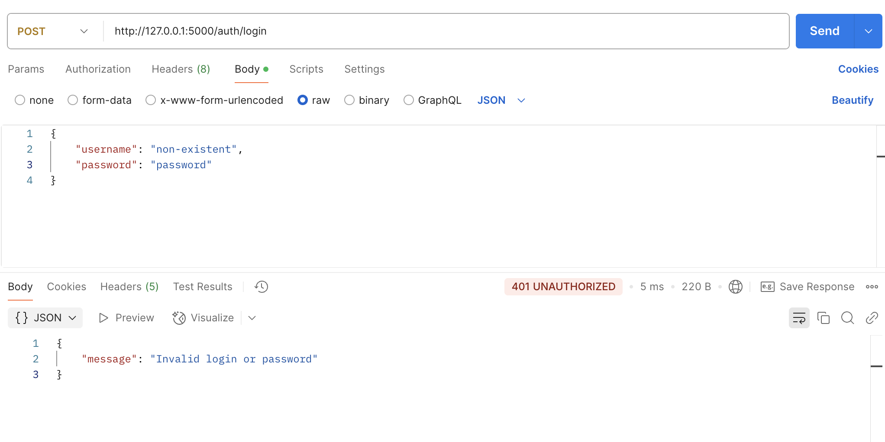
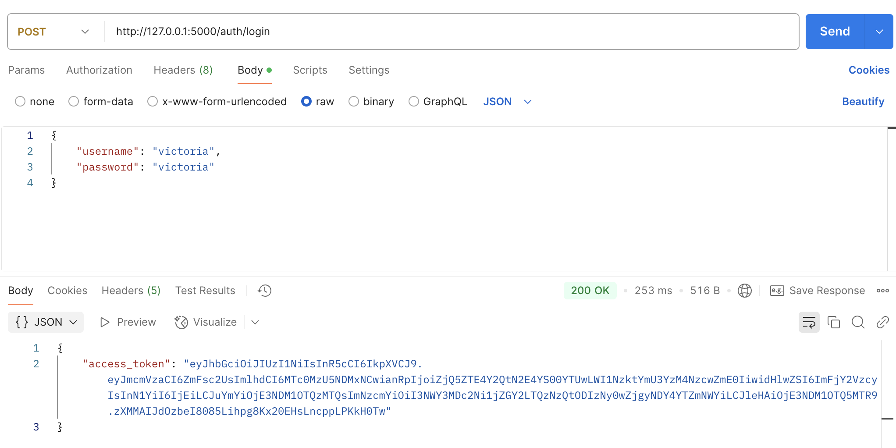
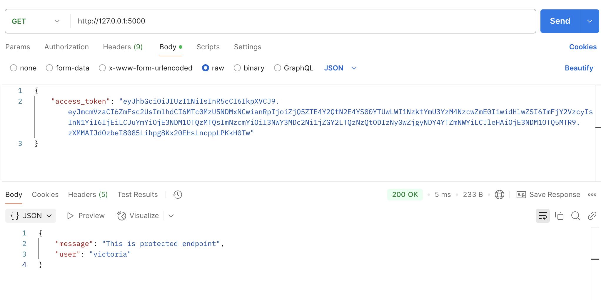
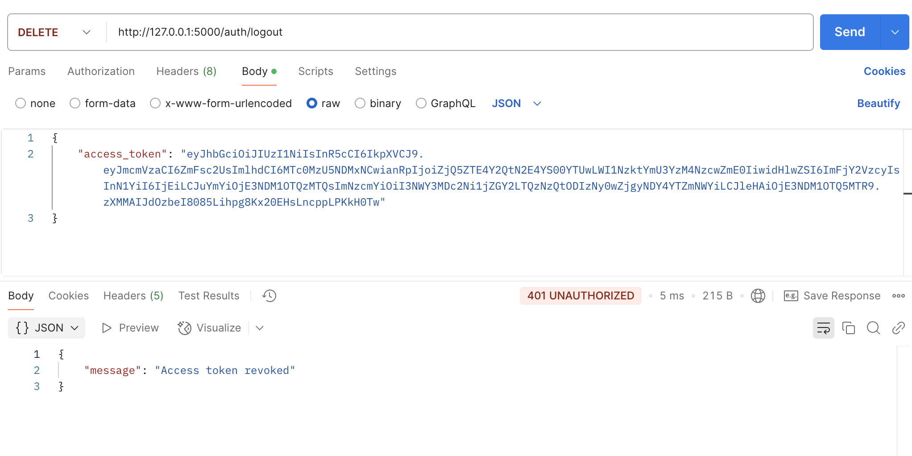
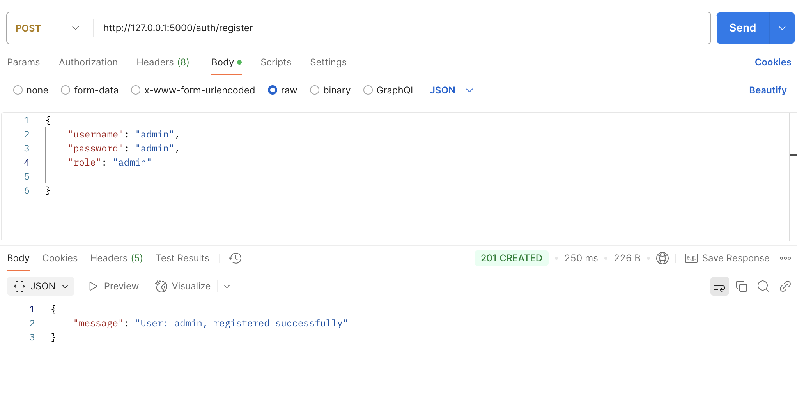
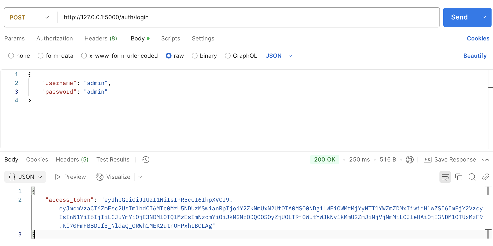
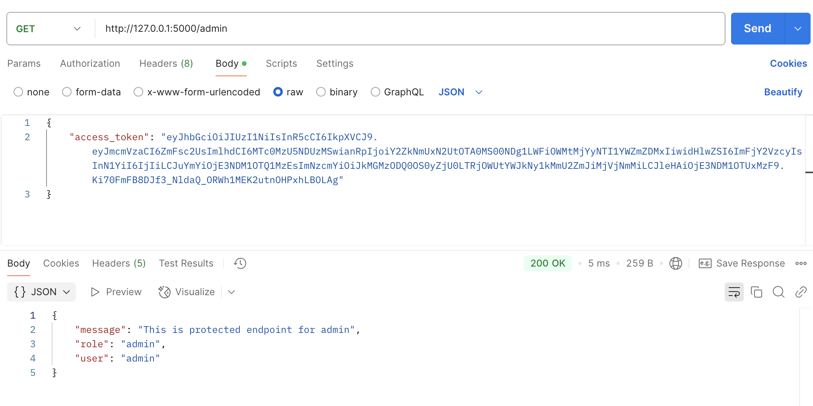
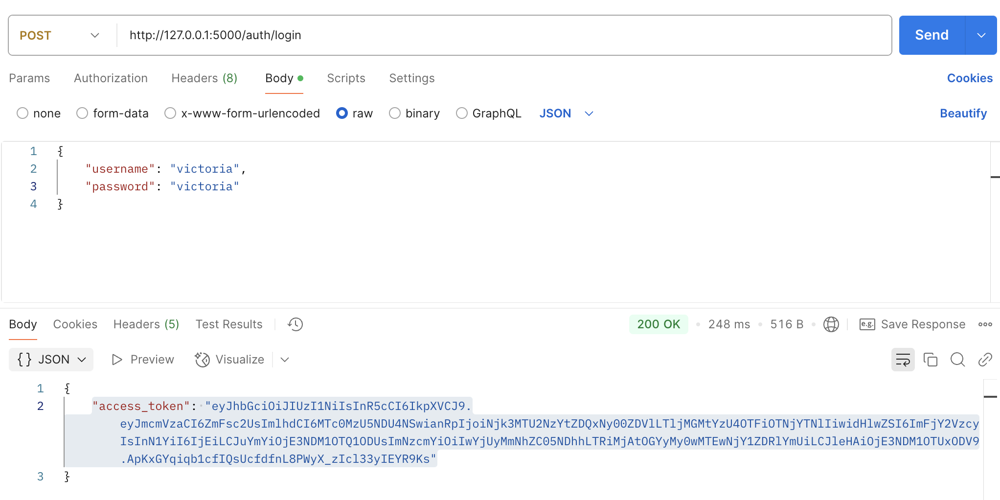
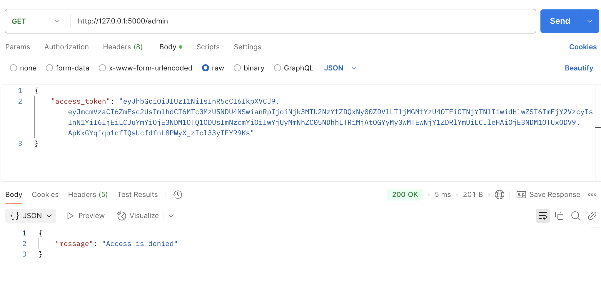

# Тестовое задание - JWT авторизация

### Используемые технологии
- Flask, SQLAlchemy
- Docker
- Redis - хранение blacklist токенов
- SQLite - хранение данных пользователя `username, password, role: admin/user`
- bcrypt - шифрование/дешифрование паролей пользователя

### Структура проекта
```
teast_task.../
| - main.py - точка входа
| - app/
   | - __init__.py - инициализация приложения, подключение endpoints
   | - config.py - конфигурация приложения
   | - content.py - защищеные endpoints: "/admin" - только администраторы "/" - все пользователи
   | - models.py - модель "User" flask-sqlalchemy
   | - auth/
      | - auth.py - endpoints для реализации аутонтефикации/авторизации и регистрации
      | - db_helper.py - CRUD функции
      | - en_de_cryption.py - де/кодирование паролей пользователя
      | - utils_jwt.py - генерация и отзыв jwt токенов
```
### Скриншоты работы
- Попытка авторизоваться с некоректным логином  

- Удачная авторизация  

- Доступ к защищенному endpoint с **token из whitelist**  

- Доступ к защищенному endpoint с **несуществующим token**  

- Аннуляция token  

- Попытка получить доступ к защищенному контенту с **token из blacklist**  

- Регистрация пользователя со статусом - администратор

- Авторизация администратора

- Доступ **администратора** к защищенному endpoint **доступному для всех ролей**

- Доступ **администратора** к защищенному endpoint **доступному только администраторы**

- Авторизация обычного пользователя

- Доступ **обычного пользователя** к защищенному endpoint **доступному только администраторы**
